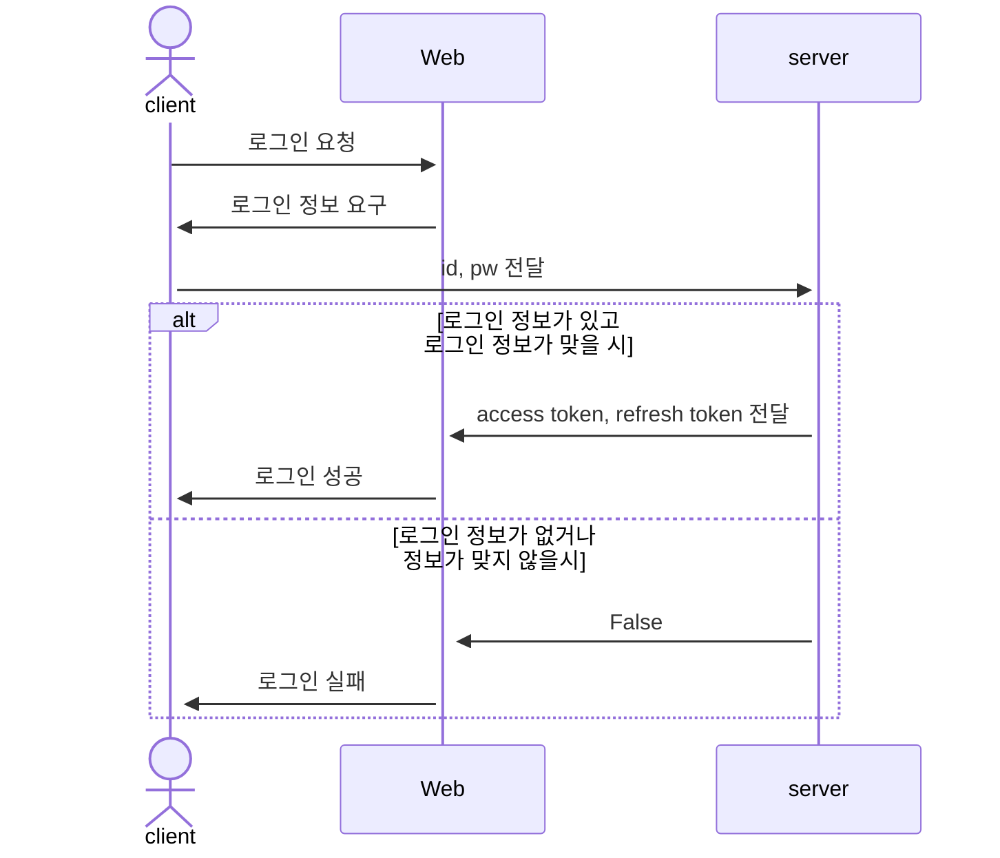
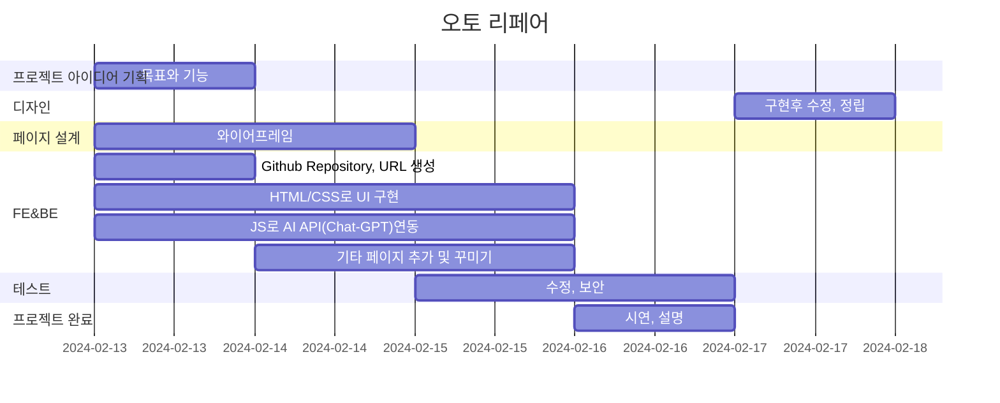
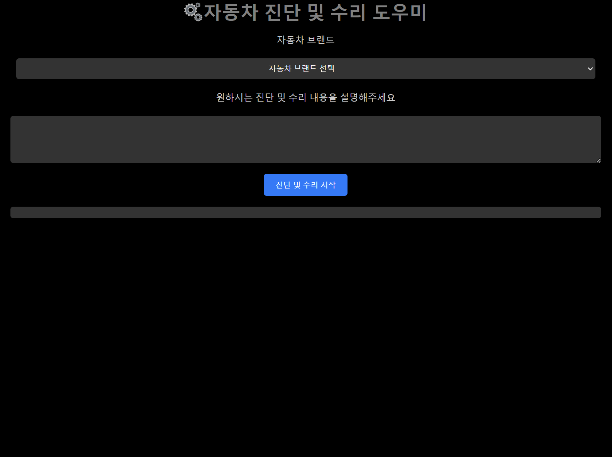
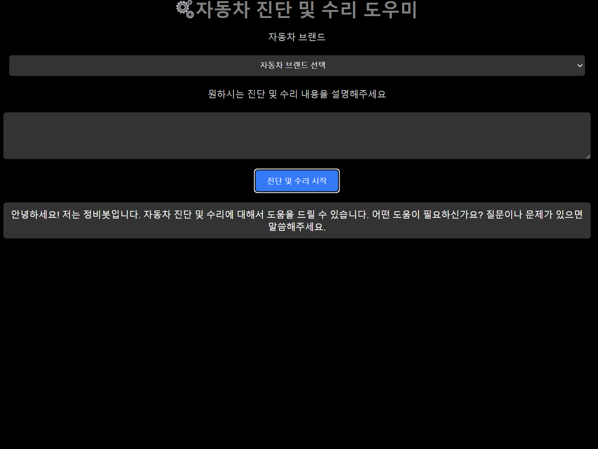
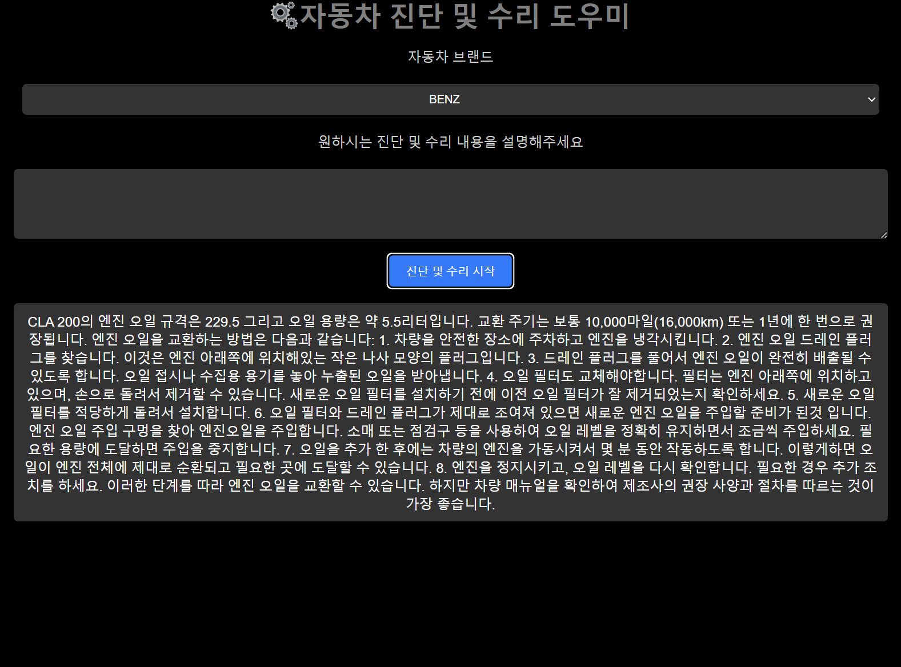
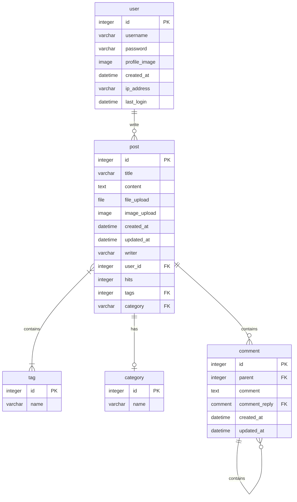
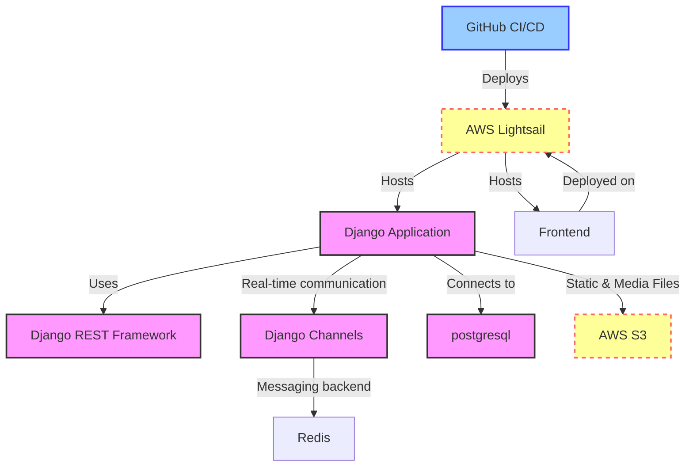
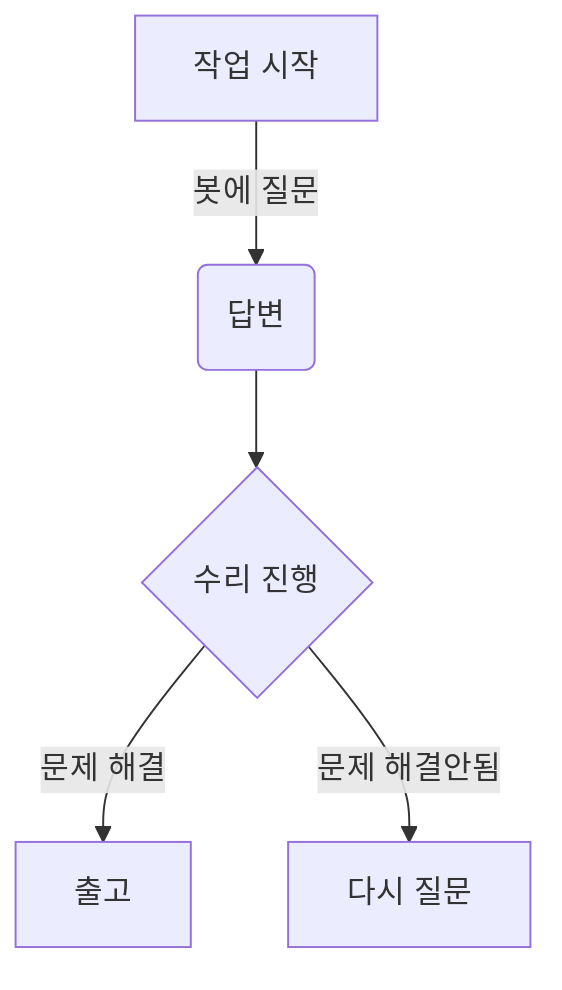

# Auto_repair
Auto repair with Chatgpt

## 1. 목표와 기능

### 1.1 목표
- AI 활용하여 자동차 서비스 산업에 안전, 금전 그리고 시간적 효율을 극대화 시키며 동시에 생산자와 소비자간 상호 불신과 마찰을 방지합니다.
  - AI가 사용자에게 받은 데이터를 통해 진단과 그에따른 가능성 높은 진단, 수리 가이드나 오더를 내립니다.
- AI가 정비사 또는 DIY 오너에게 필요한 진단, 리페어, 메인터넌스 획기적으로 돕습니다.
  - 진단 - 수많고 복잡한 컴포넌트를 열어보고 다양한 테스트를 통한뒤 진단과 리페어가 가능했던 현재에서 기존 각 차량 제조사의 데이터, 장비와 온라인 소스를 베이스로한 AI를 통해 오진 리스크를 줄이며 신속한 트러블 슈팅을 합니다.
  - 리페어 - 기존 한정됐던 문서와 약간의 이미지로 작성된 리페어 가이드를 넘어서 실사 이미지와 동영상을통해 작업자의 Health & safety 리스크와 차량과 부품의 데미지 리스크를 동시에 줄이며 재작업 확율을 감소 시켜줍니다.
  - 메인터넌스 - 믿을수있는 파트사의 경제성있는 파트를 추천, 동시에 메인터넌스 프로세스에 이어 주의사항을 작업자가 일일이 찾아볼 필요없이 순서에따라 직관적이게 보여줌으로 효율을 극대화하여
  생산성을 높여줍니다.
- 작업시간, 레벨, 리스크 등의따른 코스트 또한 AI를 통해 산정되어 소비자와 서비스 생산자간의 금전적 마찰을 줄이고 상생할수 있도록 합니다.
- 기존 관련분야 전문가들의 사용에 따른 토론, 문의, 질답을 통해 향후 자동적으로 AI를 더욱 정밀하게 향상시킬수 있습니다.

### 1.2 기능
- 프롬프트를 통해 가장 확율이 높은 진단 및 수리 가이드를 출력해줍니다.
- 작업자에게 신속성을 확보해주는 동시 작업 리스크를 줄여줍니다.
- 서비스생산자(정비,파트)와 소비자 등을 AI를 통하여 서로 신뢰할수있도록 연결시켜줍니다.
- 각 제조사별 모델별 커뮤니티 제공합니다.(변질될경우 개입이나 폐기)
- 뉴스, 리콜, 캠페인 알림기능을 제공합니다.
- 가입 전,중,후 사용자와 사용자의 차량모델에 대한 데이터 베이스로 더욱 정확하고 필요한 정보를 안내합니다.
- 향후 전용 차량스캔툴과 온라인 연동하여 더 쉽고 빠르게 정확한 답변을 보여줄수 있을것을로 예상 합니다.

### 1.3 작업자
<table>
	<tr>
		<th>신성재</th>
	</tr>
 	<tr>
		<td><p align="center"></p></td>
	</tr>
</table>

## 2. 개발 환경 및 배포 URL
### 2.1 개발 환경
- Visual Studio Code
- 서비스 배포 환경
  - Github

### 2.2 배포 URL
- https://sungjaes.github.io/auto_repair/

### 2.3 URL 구조(모놀리식)
- main

| App       | URL                                        | Views Function    | HTML File Name                        | Note           |
|-----------|--------------------------------------------|-------------------|---------------------------------------|----------------|
| main      | '/'                                        | home              | main/home.html                        | 홈화면          |
| main      | '/about/'                                  | about             | main/about.html                       | 소개화면               |


- accounts

| App       | URL                                        | Views Function    | HTML File Name                        | Note           |
|-----------|--------------------------------------------|-------------------|---------------------------------------|----------------|
| accounts  | 'register/'                                | register          | accounts/register.html                |회원가입         |
| accounts  | 'login/'                                   | login             | accounts/login.html                   |로그인           |
| accounts  | 'logout/'                                  | logout            | accounts/logout.html                  |로그아웃         |
| accounts  | 'profile/'                                 | profile           | accounts/profile.html                 | 비밀번호변경기능 / <br>프로필 수정/ 닉네임추가 |


- boardapp

| App       | URL                                        | Views Function    | HTML File Name                        | Note           |
|-----------|--------------------------------------------|-------------------|---------------------------------------|----------------|
| board     | 'board/'                                   | board             | boardapp/post_list.html               | 게시판 목록 |
| board     | 'board/<int:pk>/'                          | post_detail       | boardapp/post_detail.html            | 게시글 상세보기 |
| board     | 'board/write/'                             | post_write        | boardapp/post_write.html             | 게시글 작성 |
| board     | 'board/edit/<int:pk>/'                     | post_edit         | boardapp/post_edit.html              | 게시글 수정 |
| board     | 'board/delete/<int:pk>/'                   | post_delete       | boardapp/post_delete.html            | 게시글 삭제 |
| board     | 'board/<int:pk>/comment/'                  | comment_create    | boardapp/comment_form.html           | 댓글 작성 |
| board     | 'board/<int:pk>/comment/<br><int:comment_pk>/edit/' | comment_edit | boardapp/comment_form.html           | 댓글 수정 |
| board     | 'board/<int:pk>/comment/<br><int:comment_pk>/delete/' | comment_delete | boardapp/comment_<br>confirm_delete.html| 댓글 삭제 |


- blog


| App       | URL                                        | Views Function    | HTML File Name                        | Note           |
|-----------|--------------------------------------------|-------------------|---------------------------------------|----------------|
| blog      | 'blog/'                                    | blog              | blog/blog.html                        |갤러리형 게시판 메인 화면  |
| blog      | 'blog/<int:pk>/'                           | post              | blog/post.html                        |상세 포스트 화면    |
| blog      | 'blog/write/'                              | write             | blog/write.html                       | 카테고리 지정, 사진업로드,<br> 게시글 조회수 반영|
| blog      | 'blog/edit/<int:pk>/'                      | edit              | blog/edit.html                        | 게시물목록보기 |
| blog      | 'blog/delete/<int:pk>/'                    | delete            | blog/delete.html                      | 삭제 화면      |
| blog      | 'blog/search/'                             | search            | blog/search.html                      | 주제와 카테고리에 따라 검색,<br> 시간순에 따라 정렬|
| blog      | 'post/<int:post_pk>/comment/'              | comment_new       | blog/comment_form.html                | 댓글 입력 폼     |
| blog      | 'post/<int:post_pk>/comment/<br><int:parent_pk>/' | reply_new    | blog/comment_form.html                | 대댓글 폼      |
| blog      | 'post/<int:pk>/like/'                      | like_post         | blog/post.html                        |좋아요를 누르면 blog/post로 Redirect됨|
| blog      | 'comment/<int:pk>/update/'                 | comment_update    | blog/comment_form.html                |댓글 업데이터 경로   |
| blog      | 'comment/<int:pk>/delete/'                 | comment_delete    | blog/comment_<br>confirm_delete.html      |댓글 삭제 폼    |

### 2.4 URL 구조(마이크로식)

|app:accounts|HTTP Method|설명|로그인 권한 필요|작성자 권한 필요|
|:-|:-|:-|:-:|:-:|
|signup/|POST|회원가입|||
|login/|POST|로그인|||
|logout/|POST|로그아웃| ✅ ||
|\<int:pk\>/|GET|프로필 조회| ✅ ||
|\<int:pk\>/|PUT|프로필 수정| ✅ | ✅ |
|\<int:pk\>/|DELETE|회원 탈퇴| ✅ | ✅ |
|status/|GET|로그인 상태 확인|||
|token/refresh/|POST|만료 토큰 재발급|||
<br>  

|app:blog|HTTP Method|설명|로그인 권한 필요|작성자 권한 필요|
|:-|:-|:-|:-:|:-:|
|list/|GET|게시판 리스트| ✅ ||
|create/|POST|게시물 작성| ✅ ||
<br>

|app:interview|HTTP Method|설명|로그인 권한 필요|작성자 권한 필요|
|:-|:-|:-|:-:|:-:|
|question/|POST|면접 문제 요청| ✅ ||
|grading/|POST|면접 문제 채점| ✅ ||
|total/|POST|면접 점수 통계| ✅ ||
<br>

* 아래와 같이 표현할 수도 있습니다.

| App       | Method        | URL                               | Views Class        | Note           |
|-----------|---------------|-----------------------------------|------------------- |----------------|
| blog  | GET   | '/blog/posts/'                         |   PostViewSet                 |게시글 목록 |
| blog  | POST   | '/blog/posts/'                       |   PostViewSet                 |게시글 생성 / ChatGPT API 요청 |
| blog  | GET   | '/blog/posts/{post_id}/'                |    PostViewSet       |게시글 상세보기 / 게시글 조회수 증가 |
| blog  | PATCH   | '/blog/posts/{post_id}/'                  |   PostViewSet    |게시글 수정 |
| blog  | DELETE   | '/blog/posts/{post_id}/'                   |  PostViewSet    |게시글 삭제 |
| blog  | POST   | '/blog/posts/{post_id}/like/'                   |   PostViewSet    |게시글 좋아요 증가|
| blog  | GET   | '/blog/posts/{post_id}/comments/'                   |   CommentViewSet    | 게시물의 댓글 목록 |
| blog  | POST   | '/blog/posts/{post_id}/comments/'                   |   CommentViewSet    | 게시물의 댓글 생성 |
| blog  | GET   | '/blog/posts/{post_id}/comments/{comment_id}/'       |   CommentViewSet    | 게시물의 특정 댓글 보기 |
| blog  | PATCH   | '/blog/posts/{post_id}/comments/{comment_id}/'       |   CommentViewSet    | 게시물의 특정 댓글 수정 |
| blog  | DELETE   | '/blog/posts/{post_id}/comments/{comment_id}/'       |   CommentViewSet    | 게시물의 특정 댓글 삭제 |
<br>

|URL|페이지 설명|GET|POST|PUT|DELETE|로그인 권한| 작성자 권한|
|------|---|:---:|:---:|:---:|:---:|:---:|:---:|
|/accounts/login|로그인| |✔️| | | | |
|/accounts/logout|로그아웃| |✔️| | | | |
|/accounts/signup|회원가입| |✔️| | | | |
|/accounts/profile|프로필 <br> 프로필 수정 <br> 회원 탈퇴|✔️<br> <br> <br>| |✔️|<br><br>✔️|✔️ <br> ✔️ <br> ✔️|<br> ✔️ <br> ✔️
|/accounts/token/refresh|토큰갱신| |✔️| | | | |
|/board|게시글 목록 <br> 게시글 생성|✔️<br><br>|<br>✔️| | | <br> ✔️| |
|/board/{postid}|게시글 상세 <br> 게시글 수정 <br> 게시글 삭제|✔️<br><br><br>| |✔️|<br><br>✔️| <br> ✔️ <br> ✔️ | <br> ✔️ <br> ✔️
<br>

## 3. 요구사항 명세와 기능 명세
<!-- - https://www.mindmeister.com/ 등을 사용.
- 머메이드를 이용해 시각화. -->
  


## 4. 프로젝트 구조와 개발 일정
### 4.1 프로젝트 구조
```
📦AUTO_REPAIR
 ┣ 📂image
 ┃ ┗ 📜my1.png
 ┣ 📂style
 ┃ ┗ 📜style.css
 ┗ 📜index.html
```

### 4.1 개발 일정(WBS)


## 5. 역할

- FE, BE, 디자인: 신성재

## 6. 와이어프레임 / UI / BM

### 6.1 와이어프레임

<p align="center">기본 페이지<p>
<p align="center"><p>

<!-- - 와이어 프레임은 디자인을 할 수 있다면 '피그마'를, 디자인을 할 수 없다면 '카카오 오븐'으로 쉽게 만들 수 있습니다. -->

### 6.2 화면 설계
<!-- - 화면은 gif파일로 업로드해주세요. -->
<table>
    <tbody>
        <tr>
            <td><p align="center">도움답변<p></td>
            <td><p align="center">질문답변<p></td>
        </tr>
        <tr>
            <td>
		
            </td>
            <td>
                
            </td>
        </tr>
        <!-- <tr>
            <td>회원가입</td>
            <td>정보수정</td>
        </tr>
        <tr>
            <td>
                
            </td>
            <td>
                
            </td>
        </tr>
        <tr>
            <td>검색</td>
            <td>번역</td>
        </tr>
        <tr>
            <td>
                
            </td>
            <td>
                
            </td>
        </tr>
        <tr>
            <td>선택삭제</td>
            <td>글쓰기</td>
        </tr>
        <tr>
            <td>
	        
            </td>
            <td>
                
            </td>
        </tr>
        <tr>
            <td>글 상세보기</td>
            <td>댓글</td>
        </tr>
        <tr>
            <td>
                
            </td>
            <td>
                
            </td>
        </tr> -->
    </tbody>
</table>


## 7. 데이터베이스 모델링(ERD)

<!-- * 아래 ERD는 머메이드를 사용했습니다. -->


<!-- * 아래 ERD는 [ERDCloud](https://www.erdcloud.com/)를 사용했습니다.
 -->

<!-- * https://dbdiagram.io/home도 많이 사용합니다. -->

## 8. Architecture

<!-- * 아래 Architecture 설계도는 ChatGPT에게 아키텍처를 설명하고 mermaid로 그려달라 요청한 것입니다. -->


<!-- * 아래 Architecture 설계도는 PPT를 사용했습니다.
  


- PPT로 간단하게 작성하였으나, 아키텍쳐가 커지거나, 상세한 내용이 필요할 경우 [AWS architecture Tool](https://online.visual-paradigm.com/ko/diagrams/features/aws-architecture-diagram-tool/)을 사용하기도 합니다. -->

## 9. 메인 기능
- 진단, 수리, 정비가 필요한 사용자가 진단봇에게 자신이 필요한 질문을 하면 그에따라 진단봇이 적절한 솔루션과 정보를 알려줍니다.

- 향후 차량 진단 스캐너를 이용 고장코드를 읽고 온라인 데이터 연계 받아 과거 데이터에서 관련있는 빈번한 솔루션을 추천하여 더 빠르고 정확한 해결책을 낼수있게 기능을 추가 했으면 합니다.

- 향후 유투브등의 동영상 포함 각 메이져사의 자체 온라인 정비 지침서와 스캐너를 데이터 베이스를 연동한 기능을 추가 했으면 합니다.



## 10. 에러와 에러 해결 
- css로 사이즈와 각 구조물의 크기, 갭등을 보기 좋게 꾸미는데 한계를 느꼇으며 F12를 눌러 엘레먼츠, 스타일창을 보고 그나마 몇군데 수정을 할수있었습니다.

- 그외 해결안되거나 적용을 시켜도 적용이 안되거나 에러 메세지가 나오는 부분은 검색을 통해 정보에서 해결한 부분도 있으나 해결하지 못한 부분이 더 많습니다.

- JS를 통해 AI API 연동시 기본 자료를 주셨으나 chatgpt를 이용해서 기본틀을 만들다보니 에러가 나고 더 헤메게 되었습니다.
  다행이 기본 파일과 gpt가 만들어준 파일을 비교해가면서 부분을 수정해주니 연동되었습니다.

## 11. 개발하며 느낀점
- 이제 3달째 교육중입니다. 외계어로 보일정도인 교육과정이 제 예상보다 쉽지 않습니다. 그런데 이상하게 항상은 아니어도 흥미와 재미를 느낌니다. 

- 과제를 보고 막상 이걸 내가 어떻게해? 라고 생각 했었는데 발등에 불이 떨어지니 Chatgpt와 잔머리를 이용 다행이 '죽' 같은거라도 만든거 같습니다.

- chatgpt 없인 아무런 결과물을 못만들었을거 같고 지금까지 배운것을 혼자있을때 습관화하여 취미나 버릇처럼 공부 해야겠습니다.

- chatgpt 수준이 아직 한정되어있어 제가 원하는 수준이 안되는것을 알고 만들어보고 시연해봤습니다. 앞으로 발전이 기대되고 기회가 닿는다면 발전시켜보고 싶다는 생각 입니다.