# Auto_repair
Auto repair with Chatgpt

## 1. 목표와 기능

### 1.1 목표
- 필수품인 자동차 AI 활용하여 금전, 시간적 효율을 극대화 시키며 AI를 통해 동시에 상호 불신 상쇄함.
  (AI가 사용자에게 받은 데이터를 통해 진단과 그에따른 가능성 높은 리페어 확율 여럿 보여주며 1순위부터 오더를 내린다.)
- AI가 정비사 또는 DIY 오너에게 필요한 진단, 리페어, 메인터넌스 획기적으로 도움.
  - 진단 - 수많고 복잡한 컴포넌트를 열어보고 다양한 테스트를 통한뒤 진단과 리페어가 가능했던 현재에서 기존 각 차량 제조사의 데이터, 장비 와 온라인 소스를 베이스로한 AI를 통해 오진 리스크를 줄이며 신속한 트러블 슈팅을 함.
  - 리페어 - 기존 한정됐던 문서와 약간의 이미지로 작성된 리페어 가이드를 넘어서 실사 이미지와 동영상을통해 작업자의 Health & safty 리스크와 차량 부품의 데미지 리스크를 동시에 줄이며 작업시간 효율 향상.
  - 메인터넌스 - 믿을수있는 파트사의 경제성있는 파트를 추천, 동시에 메인터넌스 펄시져에 이어 주의사항을 작업자가 일일이 찾아볼 필요없이 한번에 직관적이게 보여줌으로 에피션시를 극대화하며 리핏리페어 확율 감소.
- 작업시간, 레벨, 리스크 등의따른 코스트 또한 AI를 통해 산정되어 소비자와 서비스 생산자간의 금전적 마찰을 줄이고 상생할수있도록 함.
- 기존 관련분야 전문가들의 사용과 문의, 질답을 통해 향후 자동적으로 AI를 더욱 정밀하게 향상시킴.

### 1.2 기능
- 프롬프트를 통해 가장 확율이 높은 진단을 내려줌.
- 작업자에게 신속성을 확보해주는 동시 작업 리스크를 줄여줌.
- 서비스생산자(정비,파트) 소비자 등을 AI를 통하여 서로 신뢰할수있도록 연결시켜줌.
- 각 제조사별 모델별 커뮤니티 제공기능.(변질될경우 개입이나 폐기)
- 뉴스, 리콜, 캠페인 알림기능.
- 가입 전중후 사용자와 사용자의 차량모델에 데이터 입력값 데이터 베이스로 프롬프트 결과값을 도출해냄.
- 향후 전용 차량스캔툴과 연동하여 더 쉽고 빠르게 정확한 값을 보여줄수도 있을것을로 예상.

### 1.3 작업자
<table>
	<tr>
		<th>신성재</th>
	</tr>
 	<tr>
		<td><p align="center"></p></td>
	</tr>
</table>

## 2. 개발 환경 및 배포 URL
### 2.1 개발 환경
- Visual Studio Code
- 서비스 배포 환경
  - Github

### 2.2 배포 URL
- https://sungjaes.github.io/auto_repair/

### 2.3 URL 구조(모놀리식)
- main

| App       | URL                                        | Views Function    | HTML File Name                        | Note           |
|-----------|--------------------------------------------|-------------------|---------------------------------------|----------------|
| main      | '/'                                        | home              | main/home.html                        | 홈화면          |
| main      | '/about/'                                  | about             | main/about.html                       | 소개화면               |


- accounts

| App       | URL                                        | Views Function    | HTML File Name                        | Note           |
|-----------|--------------------------------------------|-------------------|---------------------------------------|----------------|
| accounts  | 'register/'                                | register          | accounts/register.html                |회원가입         |
| accounts  | 'login/'                                   | login             | accounts/login.html                   |로그인           |
| accounts  | 'logout/'                                  | logout            | accounts/logout.html                  |로그아웃         |
| accounts  | 'profile/'                                 | profile           | accounts/profile.html                 | 비밀번호변경기능 / <br>프로필 수정/ 닉네임추가 |


- boardapp

| App       | URL                                        | Views Function    | HTML File Name                        | Note           |
|-----------|--------------------------------------------|-------------------|---------------------------------------|----------------|
| board     | 'board/'                                   | board             | boardapp/post_list.html               | 게시판 목록 |
| board     | 'board/<int:pk>/'                          | post_detail       | boardapp/post_detail.html            | 게시글 상세보기 |
| board     | 'board/write/'                             | post_write        | boardapp/post_write.html             | 게시글 작성 |
| board     | 'board/edit/<int:pk>/'                     | post_edit         | boardapp/post_edit.html              | 게시글 수정 |
| board     | 'board/delete/<int:pk>/'                   | post_delete       | boardapp/post_delete.html            | 게시글 삭제 |
| board     | 'board/<int:pk>/comment/'                  | comment_create    | boardapp/comment_form.html           | 댓글 작성 |
| board     | 'board/<int:pk>/comment/<br><int:comment_pk>/edit/' | comment_edit | boardapp/comment_form.html           | 댓글 수정 |
| board     | 'board/<int:pk>/comment/<br><int:comment_pk>/delete/' | comment_delete | boardapp/comment_<br>confirm_delete.html| 댓글 삭제 |


- blog


| App       | URL                                        | Views Function    | HTML File Name                        | Note           |
|-----------|--------------------------------------------|-------------------|---------------------------------------|----------------|
| blog      | 'blog/'                                    | blog              | blog/blog.html                        |갤러리형 게시판 메인 화면  |
| blog      | 'blog/<int:pk>/'                           | post              | blog/post.html                        |상세 포스트 화면    |
| blog      | 'blog/write/'                              | write             | blog/write.html                       | 카테고리 지정, 사진업로드,<br> 게시글 조회수 반영|
| blog      | 'blog/edit/<int:pk>/'                      | edit              | blog/edit.html                        | 게시물목록보기 |
| blog      | 'blog/delete/<int:pk>/'                    | delete            | blog/delete.html                      | 삭제 화면      |
| blog      | 'blog/search/'                             | search            | blog/search.html                      | 주제와 카테고리에 따라 검색,<br> 시간순에 따라 정렬|
| blog      | 'post/<int:post_pk>/comment/'              | comment_new       | blog/comment_form.html                | 댓글 입력 폼     |
| blog      | 'post/<int:post_pk>/comment/<br><int:parent_pk>/' | reply_new    | blog/comment_form.html                | 대댓글 폼      |
| blog      | 'post/<int:pk>/like/'                      | like_post         | blog/post.html                        |좋아요를 누르면 blog/post로 Redirect됨|
| blog      | 'comment/<int:pk>/update/'                 | comment_update    | blog/comment_form.html                |댓글 업데이터 경로   |
| blog      | 'comment/<int:pk>/delete/'                 | comment_delete    | blog/comment_<br>confirm_delete.html      |댓글 삭제 폼    |

### 2.4 URL 구조(마이크로식)

|app:accounts|HTTP Method|설명|로그인 권한 필요|작성자 권한 필요|
|:-|:-|:-|:-:|:-:|
|signup/|POST|회원가입|||
|login/|POST|로그인|||
|logout/|POST|로그아웃| ✅ ||
|\<int:pk\>/|GET|프로필 조회| ✅ ||
|\<int:pk\>/|PUT|프로필 수정| ✅ | ✅ |
|\<int:pk\>/|DELETE|회원 탈퇴| ✅ | ✅ |
|status/|GET|로그인 상태 확인|||
|token/refresh/|POST|만료 토큰 재발급|||
<br>  

|app:blog|HTTP Method|설명|로그인 권한 필요|작성자 권한 필요|
|:-|:-|:-|:-:|:-:|
|list/|GET|게시판 리스트| ✅ ||
|create/|POST|게시물 작성| ✅ ||
<br>

|app:interview|HTTP Method|설명|로그인 권한 필요|작성자 권한 필요|
|:-|:-|:-|:-:|:-:|
|question/|POST|면접 문제 요청| ✅ ||
|grading/|POST|면접 문제 채점| ✅ ||
|total/|POST|면접 점수 통계| ✅ ||
<br>

* 아래와 같이 표현할 수도 있습니다.

| App       | Method        | URL                               | Views Class        | Note           |
|-----------|---------------|-----------------------------------|------------------- |----------------|
| blog  | GET   | '/blog/posts/'                         |   PostViewSet                 |게시글 목록 |
| blog  | POST   | '/blog/posts/'                       |   PostViewSet                 |게시글 생성 / ChatGPT API 요청 |
| blog  | GET   | '/blog/posts/{post_id}/'                |    PostViewSet       |게시글 상세보기 / 게시글 조회수 증가 |
| blog  | PATCH   | '/blog/posts/{post_id}/'                  |   PostViewSet    |게시글 수정 |
| blog  | DELETE   | '/blog/posts/{post_id}/'                   |  PostViewSet    |게시글 삭제 |
| blog  | POST   | '/blog/posts/{post_id}/like/'                   |   PostViewSet    |게시글 좋아요 증가|
| blog  | GET   | '/blog/posts/{post_id}/comments/'                   |   CommentViewSet    | 게시물의 댓글 목록 |
| blog  | POST   | '/blog/posts/{post_id}/comments/'                   |   CommentViewSet    | 게시물의 댓글 생성 |
| blog  | GET   | '/blog/posts/{post_id}/comments/{comment_id}/'       |   CommentViewSet    | 게시물의 특정 댓글 보기 |
| blog  | PATCH   | '/blog/posts/{post_id}/comments/{comment_id}/'       |   CommentViewSet    | 게시물의 특정 댓글 수정 |
| blog  | DELETE   | '/blog/posts/{post_id}/comments/{comment_id}/'       |   CommentViewSet    | 게시물의 특정 댓글 삭제 |
<br>

|URL|페이지 설명|GET|POST|PUT|DELETE|로그인 권한| 작성자 권한|
|------|---|:---:|:---:|:---:|:---:|:---:|:---:|
|/accounts/login|로그인| |✔️| | | | |
|/accounts/logout|로그아웃| |✔️| | | | |
|/accounts/signup|회원가입| |✔️| | | | |
|/accounts/profile|프로필 <br> 프로필 수정 <br> 회원 탈퇴|✔️<br> <br> <br>| |✔️|<br><br>✔️|✔️ <br> ✔️ <br> ✔️|<br> ✔️ <br> ✔️
|/accounts/token/refresh|토큰갱신| |✔️| | | | |
|/board|게시글 목록 <br> 게시글 생성|✔️<br><br>|<br>✔️| | | <br> ✔️| |
|/board/{postid}|게시글 상세 <br> 게시글 수정 <br> 게시글 삭제|✔️<br><br><br>| |✔️|<br><br>✔️| <br> ✔️ <br> ✔️ | <br> ✔️ <br> ✔️
<br>

## 3. 요구사항 명세와 기능 명세
<!-- - https://www.mindmeister.com/ 등을 사용.
- 머메이드를 이용해 시각화. -->

```mermaid
    sequenceDiagram
    actor A as client
    participant B as Web
    participant C as server
    A->>+B: 로그인 요청
    B->>+A: 로그인 정보 요구
    A->>+C: id, pw 전달
    alt 로그인 정보가 있고 로그인 정보가 맞을 시
    C->>+B: access token, refresh token 전달
    B->>+A: 로그인 성공
    else 로그인 정보가 없거나 정보가 맞지 않을시
    C->>+B: False
    B->>+A: 로그인 실패
    end
```
  


## 4. 프로젝트 구조와 개발 일정
### 4.1 프로젝트 구조
```
📦AUTO_REPAIR
 ┣ 📂image
 ┃ ┗ 📜my1.png
 ┣ 📂style
 ┃ ┗ 📜style.css
 ┗ 📜index.html
```

### 4.1 개발 일정(WBS)

```mermaid
gantt
    title 오토 리페어
    dateFormat  YYYY-MM-DD
    section 프로젝트 아이디어 기획
    목표와 기능       :         2024-02-13, 1d
    section 디자인
    구현후 수정, 정립       :         2024-02-17, 1d
    section 페이지 설계
    와이어프레임           :         2024-02-13, 2d
    section FE&BE
    Github Repository, URL 생성 	:         2024-02-13, 1d
    HTML/CSS로 UI 구현      :         2024-02-13, 3d
    JS로 AI API(Chat-GPT)연동           :         2024-02-13, 3d
    기타 페이지 추가 및 꾸미기 :         2024-02-14, 2d
    section 테스트
    수정, 보안                     :         2024-02-15, 2d
    section 프로젝트 완료
    시연, 설명               :         2024-02-16, 1d
```


## 5. 역할

- FE, BE, 디자인: 신성재

## 6. 와이어프레임 / UI / BM

### 6.1 와이어프레임

<p align="center">기본 페이지<p>
<p align="center"><p>

<!-- - 와이어 프레임은 디자인을 할 수 있다면 '피그마'를, 디자인을 할 수 없다면 '카카오 오븐'으로 쉽게 만들 수 있습니다. -->

### 6.2 화면 설계
<!-- - 화면은 gif파일로 업로드해주세요. -->
<table>
    <tbody>
        <tr>
            <td><p align="center">도움답변<p></td>
            <td><p align="center">질문답변<p></td>
        </tr>
        <tr>
            <td>
		
            </td>
            <td>
                
            </td>
        </tr>
        <!-- <tr>
            <td>회원가입</td>
            <td>정보수정</td>
        </tr>
        <tr>
            <td>
                
            </td>
            <td>
                
            </td>
        </tr>
        <tr>
            <td>검색</td>
            <td>번역</td>
        </tr>
        <tr>
            <td>
                
            </td>
            <td>
                
            </td>
        </tr>
        <tr>
            <td>선택삭제</td>
            <td>글쓰기</td>
        </tr>
        <tr>
            <td>
	        
            </td>
            <td>
                
            </td>
        </tr>
        <tr>
            <td>글 상세보기</td>
            <td>댓글</td>
        </tr>
        <tr>
            <td>
                
            </td>
            <td>
                
            </td>
        </tr> -->
    </tbody>
</table>


## 7. 데이터베이스 모델링(ERD)

<!-- * 아래 ERD는 머메이드를 사용했습니다. -->


<!-- * 아래 ERD는 [ERDCloud](https://www.erdcloud.com/)를 사용했습니다.
 -->

<!-- * https://dbdiagram.io/home도 많이 사용합니다. -->

## 8. Architecture

<!-- * 아래 Architecture 설계도는 ChatGPT에게 아키텍처를 설명하고 mermaid로 그려달라 요청한 것입니다. -->


<!-- * 아래 Architecture 설계도는 PPT를 사용했습니다.
  


- PPT로 간단하게 작성하였으나, 아키텍쳐가 커지거나, 상세한 내용이 필요할 경우 [AWS architecture Tool](https://online.visual-paradigm.com/ko/diagrams/features/aws-architecture-diagram-tool/)을 사용하기도 합니다. -->

## 9. 메인 기능
- 진단, 수리, 정비가 필요한 사용자가 진단봇에게 자신이 필요한 질문을 하면 그에따라 진단봇이 적절한 솔루션과 정보를 알려줍니다.

- 향후 차량 진단 스캐너를 이용 고장코드를 읽고 온라인 데이터 연계 받아 과거 데이터에서 관련있는 빈번한 솔루션을 추천하여 더 빠르고 정확한 해결책을 낼수있게 기능을 추가 했으면 합니다.

- 향후 유투브등의 동영상 포함 각 메이져사의 자체 온라인 정비 지침서와 스캐너를 데이터 베이스를 연동한 기능을 추가 했으면 합니다.

```mermaid
		graph TD
	    A[작업 시작] -->|봇에 질문| B(답변)
	    B --> C{수리 진행}
	    C -->|문제 해결| D[출고]
	    C -->|문제 해결안됨| F[다시 질문]
```



## 10. 에러와 에러 해결 
- css로 사이즈와 각 구조물에 갭등을 보기 좋게 꾸미는데 한계를 느꼇으며 F12에 엘레먼츠, 스타일창을 보고 그나마 몇군데 수정을 할수있었습니다.

- 그외 해결안되거나 에러 메세지가 나오는 부분은 검색을 통해 정보에서 해결한 부분도 있으나 해결하지 못한 부분이 더 많습니다.

- JS를 통해 AI API 연동시 기본 자료를 다 주셨으나 chatgpt를 이용해서 기본틀을 만들다보니 에러가 나고 더 헤메게 되었습니다.
  다행이 기본 파일과 gpt가 만들어준 파일을 비교해가면서 부분을 수정해주니 연동되었습니다.

## 11. 개발하며 느낀점
- 이제 3달째 교육중 머리에 입력이 안되고 외계어나 진흙탕으로 보이다가 가끔 입력되다가도 흩어져버리는 상황 그런데 항상은 아니어도 간혹 재미와 흥미를 느낌니다. 

- 막상 이걸 내가 어떻게해? 라고 생각 했었는데 발등에 불이 떨어지자 Chatgpt와 잔머리를 이용 다행이? '죽'이라도 만든거 같습니다.

- 앞으로 배워야 할게 더 많지만 지금까지 배운것을 혼자있을때 습관화하여 버릇처럼 공부 해야겠습니다.
